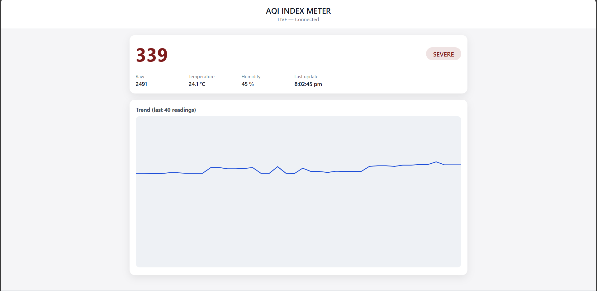

<h1 align="center">🌫️AirSense</h1>

<b>Real-Time Air Quality Index Monitoring with Live Dashboard</b> 
ESP32 • Sensors • Cloud • Data Visualization

  
  
  

---

## 🌍 Overview
The AirSense is a **real-time air quality monitoring solution** designed to measure pollution levels and environmental conditions using IoT sensors.

The system continuously reads gas sensor values, converts them into **standard AQI levels**, and publishes the data to a **cloud-connected live dashboard** for visualization and trend analysis.

---

## 🎯 Problem Statement
Air pollution monitoring is often:
- ❌ Expensive
- ❌ Not accessible in real time
- ❌ Limited to fixed stations

This project provides a **low-cost, real-time AQI monitoring solution** suitable for indoor and outdoor environments.

---

## ✨ Key Features
- 🧪 Real-time AQI measurement
- 🌡️ Temperature & humidity monitoring
- 📡 Live cloud data synchronization
- 📈 AQI trend visualization
- 🎨 Color-coded AQI status indicators
- ⏱️ 1-second refresh rate

---

## 🧠 System Architecture
Gas Sensor + DHT11  
↓  
ESP32  
↓  
Firebase Realtime Database  
↓  
Live Web Dashboard

---

## 🔧 Hardware Components
- ESP32 (WiFi-enabled microcontroller)
- MQ-135 Gas Sensor
- DHT11 (Temperature & Humidity)
- 16×2 I²C LCD Display

---

## 🌐 Web Dashboard Features
- 🔢 Live AQI value display
- 📊 Real-time AQI trend graph
- 🌈 Status-based color indicators
- 🕒 Last update timestamp
- 📱 Responsive & minimal UI

---

## ☁️ Cloud & Backend
- **Firebase Realtime Database**
- REST-based communication from ESP32
- Lightweight JSON data structure

---

## 🛠️ Tech Stack

### Hardware
- ESP32
- MQ-135 Gas Sensor
- DHT11
- LCD Display

### Software
- HTML, CSS, JavaScript
- Firebase Realtime Database
- Canvas-based chart visualization

---

## 📂 Repository Structure

AirSense/  
├── Firmware/ # ESP32 Source Code  
├── Dashboard/ # Web dashboard Files  
├── Previews/ # UI images and Prototype Images 
└── README.md

---

## 📸 Screenshots

---

## 🌍 Applications
- Urban air quality monitoring
- Indoor air quality analysis
- Environmental studies
- Smart buildings

---

## 🚀 Future Enhancements
- Multi-gas sensor support
- Mobile app integration
- AQI alerts & notifications
- Location-based AQI mapping

---

## 👤 Author
**Shlok**   

> Built with focus on real-time monitoring, reliability, and environmental impact.
